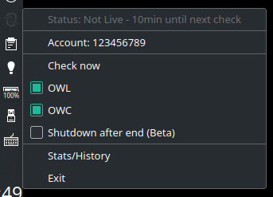
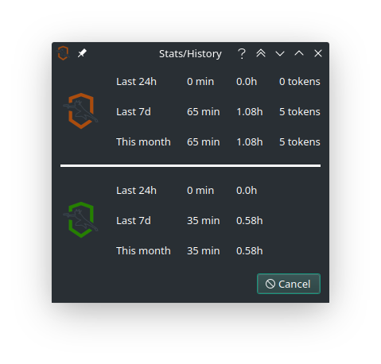

# Overwatch Omnic Rewards

A **System Tray** app designed to **help** players **earn Overwatch League tokens** and **Contenders skins**. Cross-platform (Windows/Linux/MacOS). Created using Python and PyQt. 

## Features
- Earn **OWL tokens and OWC skins** in the **background**
- **No Login Required**
- **Very lightweight**, doesn't inflate Youtube views 
- Uses the same mechanism as OWL/OWC website (Small colored dot)
- **Stats** - Show Hours watched/tokens earned (also csv file)
- Can **Shutdown computer** after stream ended 


System Tray                |  Stats page
:-------------------------:|:-------------------------:
  |  


## Table of Contents

- [Install](#install)
- [FAQ](#faq)
- [How to run](#how-to-run)
- [Developing](#developing)
    - [Testing the app](#testing-the-app)
    - [Debugging the app](#debugging-the-app)
    - [Building/package the app](#building/package-the-app)
- [Common Problems/Additional Questions](#common-problems/additional-questions)
- [Considerations](#considerations)

## Install

Check the [releases section](https://github.com/shirokumacode/overwatch-omnic-rewards/releases/) for Windows/Linux executables. MacOS users should check out the [How to run](#how-to-run) section to run the app.

## FAQ
<details>
<summary>How does it work?</summary>
The app checks every 10min if OWL/OWC is currently live. If it's live, it will start to "watch" and track watch time.
</details>

<details>
<summary>What does it need?</summary>
No logins, no passwords. It only needs your Blizzard user_id that you can obtain in <5secs. Follow the steps on the app to get it. 
</details>

<details>
<summary>Does it work?</summary>
It does. I've tested the mechanism for the past month. I haven't open the OWL/OWC website so far and earned all the tokens and June OWC skins.
</details>

<details>
<summary>Is it more reliable than the website?</summary>
It is as you don't rely on the youtube player status (playing/not playing) to track. Also you can have adblockers blocking the necessary tracking endpoints. Hovewer I can't guarantee the OWL tracking endpoints are working at 100%. You can use both this app and the website if you want to make sure 100%.
</details>

<details>
<summary>Won't this get detected/broken?</summary>
This app behaves like a normal browser/user and should be undetectable.
I reverse engineered the mechanism that is used to track the user on OWL/OWC site. The mechanism itself is very simple. 

There is a possiblity that the devs change the mechanism used, but it should be possible to patch the app fairly easily. Can't guarantee it will work forever. 
</details>

<details>
<summary>I am a developer. Can I see this method/code?</summary>
You should check out the utils folder and the examples inside. Any python programmer should be able to see what it does in <5min. Feel free to use/reimplement or even create your own headless version.
</details>

<details>
<summary>Can you make this app run at startup/login/boot?</summary>
You certainly can. Just download the executable follow the steps below
- [Windows guide](https://support.microsoft.com/en-us/windows/add-an-app-to-run-automatically-at-startup-in-windows-10-150da165-dcd9-7230-517b-cf3c295d89dd)
- Linux - depends on the distribution/DE exemple [KDE](https://userbase.kde.org/System_Settings/Autostart) [Arch](https://wiki.archlinux.org/title/autostarting#On_desktop_environment_startup)
</details>

## How to Run

Run the executables from the releases section 

OR

1. Clone the repository 
2. Install Python and then pipenv
```shell
pip install pipenv
```
3. Run the app
```shell
pipenv run python gui.py
```

## Developing

This app uses pipenv to manage its requirements. Install the dev requirements if you want to develop and test the app
```shell
pipenv install --dev
```
and then start a shell to get to the virtual env and then run the app.
```shell
pipenv shell
python gui.py
```

(Optional) You can compile your own pyqt resource file. I already provide it for ease of use but you should make sure the code is right.
```shell
pyrcc5 resources.qrc -o resources_qc.py
```

### Testing the app
Given that the OWL/OWC isn't always live it is unfeasible to test the app. I created a simple flask server to mock the requests - test/flaskapi.py
```shell
cd test/
python flaskapi.py
```
You can comment/uncomment certain lines to get the desired behaviour you want to mimic or even change how many minutes you want to fake "watch".

To run the app using local endpoints
```shell
python gui.py --debug
```

### Debugging the app
Run the app with verbose mode (logging level: info)
```shell
python gui.py -v
```
You can also set the logging level (info, warning, debug) with
```shell
python gui.py -l <logging level>
```

### Building/package the app
Simply run PyInstaller
```shell
pyinstaller gui.py -n omnic_rewards --onefile 
```
Windows build
```shell
pyinstaller gui.py -n omnic_rewards -w -i icons\iconowl.ico --onefile 
```

Code/PR away and feel free to criticize my code. I would very much like to **get real advice** as it was my first time using PyQt.

## Common Problems/Additional Questions

<details>
<summary>The app is displaying errors</summary>
The app should tell you what the problem is. Make sure your account is set and you are connected to the Internet. 

If you get a notification as well it needs user intervention. Use the check now button/action to see if it clears. 
</details>

<details>
<summary>Getting "Watcher Bad API Response"</summary>
It is probably the tracking endpoints having a breakdown. When people complain the circle is disappearing on the website it's this error.
</details>

<details>
<summary>"OWC/OWC seems Live, not tracking" - Getting 0min watched warning</summary>
When the stream ends, the OWL website takes a while to remove the live now panel. The app detects it is "live" but it can't track/"watch". This is most likely the reason. 
</details>

<details>
<summary>My app dissappeared</summary>
That indicates a hard crash. Try to reproduce it and open a issue on Github so I can fix it.
</details>

<details>
<summary>My PC didn't shutdown after the stream ended</summary>
The app tries to shutdown the computer on the next false live check. Howewer keep in mind it's still in beta:
- Linux: Depends on your distro having *systemmctl*
- Windows: Not tested but should work
- MacOS: Can't test if the method used to shutdown works at all (open issue on Github if it doesn't)
</details>

<details>
<summary>My problem isn't listed here</summary>
Open an issue on Github so I can try to fix it
</details>

<details>
<summary>Can I change the time between checks?</summary>
You can via the config file (config.json) but you might get 0min watched warnings. Check the problem above. I feel 10min (default) is a good compromise.
</details>

<details>
<summary>Can I run this with multiple accounts?</summary>
You can. To do this you should place the app in different folders with different config files (config.json) for each account.
</details>

<details>
<summary>Can I get my watch history with more detail?</summary>
The app creates a csv file with your watch history. Check the created file - history.csv
</details>

<details>
<summary>Can I run this without the system tray icon?</summary>
You can but it is not advisable. The argument -q or --quiet make the system tray not visible. You should enable it with the -v argument so you can get feedback of what is it doing
```shell
python gui.py -q -v
```
You can also develop your own headless version using the example inside the utils folder.
</details>

<details>
<summary>This app is really good. Can I hire you?</summary>
My resume consists of 4999SR Genji main with coding on the side. I accept food as payment. Email me
</details>


Contact me/Open a discussion for further explanations or anything else not explained here


